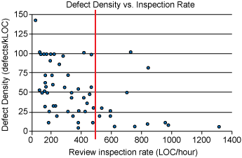

### Code Review Best Practices


*Source: tsh.io/../bad-coding-practices-meme.jpg*

**Introduction**

What Is a Code Review?

**Code review** (sometimes referred to as peer review) is a software quality assurance activity in which one or several people check a program mainly by viewing and reading parts of its source code... At least one of the persons must not be the code's author. The persons performing the checking, excluding the author, are called "reviewers.

*Source: https://en.wikipedia.org/wiki/Code\_review*

Why Review Each Others Code?

Code reviews are important because they improve code quality and make your codebase more stable. In addition, they help programmers build relationships and work together more effectively.

Implications of Code Review

Peer review can put strain on interpersonal team relationships. Therefore, in order for peer code review to be successful, it is important that mangers create a culture of collaboration and learning in peer review. While it´s easy to see defects as purely negative, each bug is actually an opportunity for the team to improve code quality. Peer review also allows team members to learn from each other and for even the most experienced programmers to break bad habits.

Defects found in peer review should not be used as a rubric for evaluating team members. Reports pulled from peer code reviews should never be used in performance reports. If personal metrics become a basis for compensation or promotion, developers will become hostile toward the process and naturally focus on improving personal metrics rather than writing better overall code.

**Scope**

Code Review is a wide topic. Therefore, this article will be kept short and (hopefully) meaningful by outlining best practices for authors, reviewers and the team before diving deep into one aspect of code review: Comments. This includes comments by the author within the code (especially as it pertains to the reviewer) and comments made during code review by all parties involved.

**Goal**

The aim of this article is to highlight code review best practices, so as to improve code review processes.

**Authors**

- **Annotate your code before the review.** Annotations guide the reviewer through the changes, showing which files to look at first and defending the reason behind each code modification. Annotations should be directed at other reviewers to ease the process and provide more depth in context. As an added benefit, the author will often find additional errors before the peer review even begins.
- **Do not write complicated code.**
- **Make good use of commit messages.** Here is a widely quoted standard of commit messages by Tim Pope: https://tbaggery.com/2008/04/19/a-note-about-git-commit-messages.html
- **Leave a comment explaining why.** You should where necessary leave a direct comment to the reviewer(s) explaining why certain decisions where made etc
- **Pick the best reviewer.** The best reviewer is the person who will be able to give you the most thorough and correct review for the piece of code you are writing, within a reasonable period of time. This usually means the owner(s) of the code. Sometimes this means asking different people to review different parts of the code. If you find an ideal reviewer but they are not available, you should at least inform them of your change.

**Reviewers**

- Review fewer than 400 lines of code at a time.


*Source: smartbear.com/../best-practices-for-peer-code-review/*

- Take your time. Inspect less than 500 lines of code per hour.



*Source: smartbear.com/../best-practices-for-peer-code-review/*

- Praise the developer.
- Do not refactor the code instead of reviewing it.
- Do not assume.

**Both Authors and Reviewers**

- **Be polite and respectful.** Give feed back the helps not hurts. Resist the urge to say: "This is wrong". Rather, you might say “If we use two for loops then this will execute slower.” That can spur a conversation instead of making the coder feel bad. If you hear someone else use these terms, ask them questions like “Can you help me understand why you feel this is wrong?” This will help them stop and think, and hopefully they can explain their intent rather than using blanket absolutes.
- **Communicate, communicate, communicate.** Use multiple team channels to communicate about code. Between email, over-the-shoulder, Microsoft Word, tool-assisted and hybrids of all types there are countless ways to collaboratively review code.
- **Devote a certain portion of your time for code reviews.**
- **Review your own code and other code too.**

**Team**

- **Use static code analysis tools.** (e.g Soda, SpotBugs, CheckStyle, PMD)
- **Consider using a developer code quality/review guide.** Such a guide code include code quality and code review check lists etc.
- **Emplace stalemate resolution strategy.** It is best practice to include a stalemate resolution strategy in a code review process. This strategy allows the team to operate efficiently in the event of divergent views. The strategy should consider allowing those involved to take a preliminary decision in advance of actual resolution. For example: The author should do what the reviewer says but raise an objection if need. A statement resolution strategy may include steps e.g:

```
Try to resolve  -->  Face to face/video  -->  Invite team
```

Make sure to record the results of any external discussion as a comment, for future readers.

**Examples**

One of the hardest parts of getting a code review right is communicating the human touch. When we give and receive feedback, human habit can create cognitive distortion by defaulting to the most negative aspects of that feedback.

**Commit Messages**

Commit messages should include what and if necessary why

-  Make compile again
-  Add jcsv dependency to fix IntelliJ compilation

Commit messages do not need to include how

-   Add jcsv dependency to fix IntelliJ compilation by formatting csv before compilation
-  Add jcsv dependency to fix IntelliJ compilation

**Comments**

Avoid meaningless comments. Comments should be actionable

-  // FIXME Should we delay a second or two before retrying?
-  The answer to the FIXME question is probably best answered by the author of the code (after consultations) or the reviewer.

Avoid useless TODOs

- 
```java
// TODO Replace this condition with a function

if (user.isActive() && user.getCountry().equals(“Nigeria”)) {

}
```

- 
```java
if (isActiveUserFromIreland(user)) { 
    
}
```

**Reviewer Examples**

It is important for any reviewer to remember that just because a code author wrote code in a different style or manner from you, doesn't mean that the code is written incorrectly. If you catch yourself writing a review comment that includes the words "should" or "must" then you ought to take a step back and think about whether your suggestions are coming from a place of fairness or a place of bias. Ask yourself: Is the use of absolutes warranted here? Sometimes it will be both fair and warranted.

If you do need to use a should/must statement, be sure to back up your assertions with documentation to help the code author understand why a change must be made. Typically, the fair response to something you don't agree with is to ask why an author wrote code this way, instead of saying it must be another way.

Do not use absolutes

Do not say: "This is wrong" or "This is bad" etc

-  This is wrong! This goes against the basic DRY principle.
-  This is repeated elsewhere, thus violating the DRY principle. I would prefer you... Meanwhile, is there a reason why you chose to go the way you did?

(In ascending order of evilness: could, should, need to, must)

- This should be renamed to *fetchUserData.* Let's be clear exactly what the method is doing.
- The method could be renamed to *fetchUserData to explicitly capture what it does.*
-  Rename this to *fetchUserData*
-  This has to be renamed to *fetchUserData*
- This should be renamed to *fetchUserData*

(Avoid very, too etc)

- This method is tool long
- You should split this method into smaller methods
- This method could be split into smaller methods to make the code easier to understand.

Do not use condescending comments.

- Help me understand why this code prefers mutable to immutable data
-  Any good developer should know that immutability is important

Words such as “just”, “easy”, “only”, or “obvious” can come across belittling and condescending.

-  Why don’t you just create a separate function
-  You should create a separate function for obvious reasons
- Creating a separate function would make this code cleaner
- Why don’t you create a separate function to make this code cleaner

Praise the developer where necessary. Don't add but after your praise

-  This is OK but it could be better.
-  I am aware you have spent much time working on this, but...
- I am impressed by this. You have created reusable code. Let's make it better by...

Praise works well before critical reviews.

- I enjoyed reading your code. Well done. Meanwhile, this logic is repeated elsewhere (I counted 9 places already), thus violating the DRY principle.
-  This logic repeated elsewhere (I counted 9 places already), thus violating the DRY principle.

Give room for manoeuvre.

Questions are a good way to give room for continuous communications

-  Replace this with an enum
- This could be replaced with an enum, except if there is a good reason to use Strings.
-  This should be replaced with an enum

Use questions

- This method could be split into smaller methods. Let me know if there is a reason not to.
-  This method is tool long
- Is there anything preventing this method from being split into smaller methods? Let me know
-  Please split this method into smaller methods

Be impersonal

- This code forgot to close the connection.
-  You did not close the connection
- This connection was not closed
-  You forgot to close the connection

Do not make reference to others' experience

-  I understand that you are inexperienced at this, but you... Rather than allude to the author's inexperience, provide documentation/links to documentation that would help

Show involvement. Prefer “we” to “you”

-  You need to improve this
- We could improve this by...
- We need to improve this
-  Your code breaks existing...
-  Your code may break existing...
- Our code may break existing...

Reviewers perspective

-  It's hard to understand your code
- Help me understand this code.
-  This code is hard to understand
- It’s hard for me to understand this code

Explain why

-  You forgot to close the connection
- This code forgot to close the connection which causes a leak of a file descriptor. Because the socket is bound to an address, no other socket will be able to bind to the same address.

Don't assume the author knows why

-  Your code breaks existing...
-  This code may break existing...
- This code may break existing... as it does not take into account...

Do not make assumptions.

- Help me understand why this code uses a BigDecimal here?
- Is there a good reason why you used a BigDecimal here?
-  This should be an integer. (Assumes the developer cannot see that this should be an integer)

Questions could be made more respectful

-  Is this necessary?
- Help me understand why this is necessary.
-  This is irrelevant

The word "please" could be misleading

-  Change this to an enum.
-  Please change this to an enum.
- Help me understand why you chose to use strings rather than enums.

Again, questions to the rescue

-  Use explicit variable names.
-  Please don't use cryptic variable names.
- I see you used appropriate variable names elsewhere. Did you miss this?

Avoid useless opinions. Simply confirm and state the fact, even if the fact is not clear.

-  I am not sure, but I think it might be better to...
- The documentation here (INSERT_LINK) and here (INSERT_LINK) suggests... However, there is ongoing discussion about this issue here (INSERT_LINK). I suggest you...

Add value

-  Point out the same typographical error which occurs 15 times
- This code contains multiple spell check errors, and could benefit from xyz plugin

**Exercise**

Try your hands on the following by selecting which of the choices is not best practice.

No sarcasm

- Maybe I wasn’t clear enough when I explained this earlier (?) As I said earlier
- Please read the earlier comments I made
- I believe this was explained earlier when I said ...
- You obviously missed the earlier comments I made

Miscellaneous

- Make these variables private.
- This code exposes the internals of this class by using public variables, thus violating OCP. Is this intentional? Am I missing something?
- Why did you make these variables public?

You can use emojis (For example when the exchange gets tense)

**Takeaways**

- Know the implications of code review. For example, it can put strain on interpersonal team relationships Review fewer than 400 LOC at a time.

- Review less than 500 LOC per hour.

- If anything looks suspicious, let the author explain it.

- Good Phrases to Use:

    - Help me understand
    - Am I missing something
    - Is there a good reason why Good actions to take

- Take a step back

- Postpone responding

Speaking of comments, here's one to make you laugh ..or cry

```
// 
// Dear maintainer:
//
// When I wrote this, only God and I understood what // I was doing. Now, only God knows!
// 
// Once you are done trying to 'optimize' this routine, // and have realized what a terrible mistake that was, // please increment the following counter as a warning // to the next guy:
// 
// total\_hours\_wasted\_here = 429
// 
```

**Sources:**

- [Google Code Review DeveloperGuide](https://google.github.io/eng-practices/review/)
- [smartbear.com/../best-practices-for-peer-code-review](https://smartbear.com/learn/code-review/best-practices-for-peer-code-review/)
- [michaelagreiler.com/respectful-constructive-code-review-feedback](https://www.michaelagreiler.com/respectful-constructive-code-review-feedback/)
